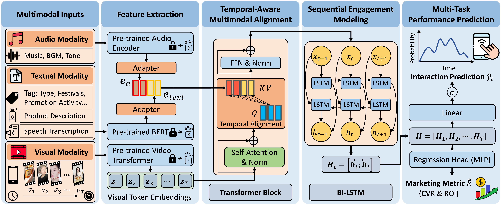

# AdsTrace: A Multimodal Dataset for Second-by-Second CTR and Advertising Effectiveness Prediction in Short-video Ads

[](https://huggingface.co/datasets/Xiuze/AdsTrace)
[](LICENSE)
[](https://pytorch.org/)

This repository contains the dataset tools for **AdsTrace** benchmark dataset, and the implementation of **TAMAN**. TAMAN aligns hierarchical marketing metadata (Text + Audio) with temporal visual tokens to predict second-by-second engagement (iCTR) and global business metrics (ROI/CVR).

## AdsTrace Dataset
<p align="center">

</p>

## TAMAN Framework
<p align="center">

</p>

## 🛠️ Installation
```bash
# Clone the repository
git clone https://github.com/XiuzeZhou/AdsTrace.git
cd AdsTrace

# Install dependencies
pip install -r requirements.txt
```

## 📊 Quick Start

### 1. Download Pre-trained Models

- **Swin-B**: [timm/swin_base_patch4_window7_224.ms_in1k](https://huggingface.co/timm/swin_base_patch4_window7_224.ms_in1k)
- **BERT-base-chinese**: [google-bert/bert-base-chinese](https://huggingface.co/google-bert/bert-base-chinese)
- **Wav2Vec**: [jonatasgrosman/wav2vec2-large-xlsr-53-chinese-zh-cn](https://huggingface.co/jonatasgrosman/wav2vec2-large-xlsr-53-chinese-zh-cn)

Place the pre-trained models (Swin-B, BERT-base-chinese, Wav2Vec 2.0) in ./pretrained_models/ 
```
├── pretrained_models/
|   ├── bert-base-chinese/
│   ├── swin_base_patch4_window7_224/
│   └── wav2vec2-large-xlsr-53-chinese-zh-cn/
```

### 2. Data Preparation

**AdsTrace** dataset: https://huggingface.co/datasets/Xiuze/AdsTrace

Obtain data from Huggingface and organize your dataset:
```
├── datasets/AdsTrace/
|   ├── audios_16k/
│   ├── frames/
│   ├── ictr/
│   ├── transcripts/
│   ├── products_cn.json
│   ├── products_en.json
│   ├── tags_cn.csv
│   └── split.json
```

### 3. Training


### 4. Visualization
Generate case studies (Acoustic-Textual Alignment) for the test set:
```bash
python visualize_inference.py --exp_name TAMAN_Final --num_cases 5
```
